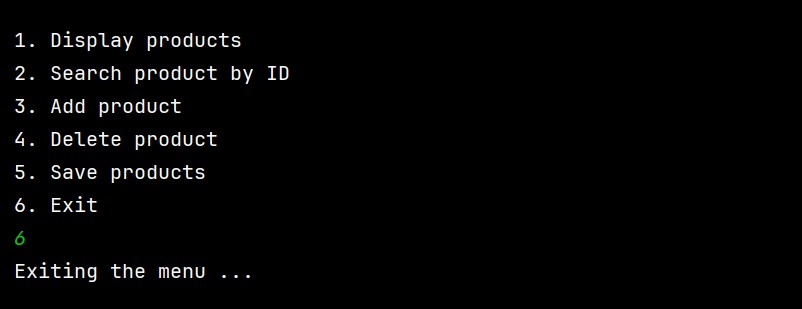

# TD – Java Input/Output & Exception Handling

This repository contains Java TD exercises focused on file input/output operations, object serialization, and exception handling.  
Each exercise includes a problem description, solution explanation, and execution screenshots where applicable.

---

## Exercise 1 – Simulating the `ls` Command
**Problem:**  
Develop a Java program that simulates the `ls` command by displaying the list of files and directories contained in a given directory, along with their types and access permissions.

**Solution:**  
- Used the `File` class to represent directories and files.  
- Read the directory path from the user.  
- Checked whether each entry is a file or a directory using `isFile()` and `isDirectory()`.  
- Displayed access permissions using `canRead()`, `canWrite()`, and `isHidden()`.  
- Printed the absolute path, type (`<FILE>` or `<DIR>`), and permissions for each entry.

**Execution screenshot:**  

---

## Exercise 2 – Product Management with Object Serialization
**Problem:**  
Create a product management system that allows storing, retrieving, searching, deleting, and saving products using object serialization in a file named `products.dat`.

**Solution:**  
- Created a `Product` class implementing the `Serializable` interface.  
- Defined an `IProduitMetier` interface to declare product management methods.  
- Implemented the interface in `MetierProduitImpl` using a `List<Product>`.  
- Used `ObjectOutputStream` to save products to a file and `ObjectInputStream` to reload them.  
- Implemented a menu-driven application to interact with the user.

**Execution screenshots :**  
Display Menu :
  
Display the list of products :

Search for a product by its ID:

Add a new product to the list :

Display the list of products after deleting the product :

Delete a product by ID :

Save the products: this option saves the list of products to a file named products.dat :

Exiting the program :

---

## Exercise 3 – Calculator with Exception Handling
**Problem:**  
Create a `Calculator` class with methods to perform division, string-to-number conversion, and basic arithmetic operations while handling common errors.

**Solution:**  
- Implemented a `divide(a, b)` method that checks for division by zero.  
- Used `try/catch` to handle invalid number conversion in `convertToNumber(text)`.  
- Implemented a `calculate(operation, a, b)` method using a `switch` statement.  
- Displayed error messages for unsupported operations and invalid inputs.

**No Execution screenshots in this Exercise** 

---

## Exercise 4 – Custom Exception: Speed Control
**Problem:**  
Create a custom exception to detect when a vehicle exceeds a defined speed limit and display the exception call stack.

**Solution:**  
- Created a `TooFastException` class extending `Exception`.  
- Implemented a `Vehicule` class with a `testSpeed()` method.  
- Threw the custom exception when the speed exceeds 90.  
- Caught the exception in the `main` method and displayed the call stack using `printStackTrace()`.

**Execution screenshot:**  

